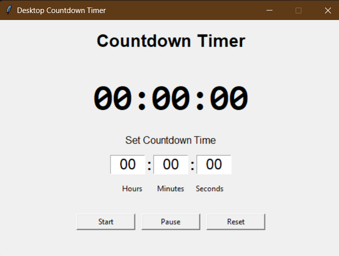
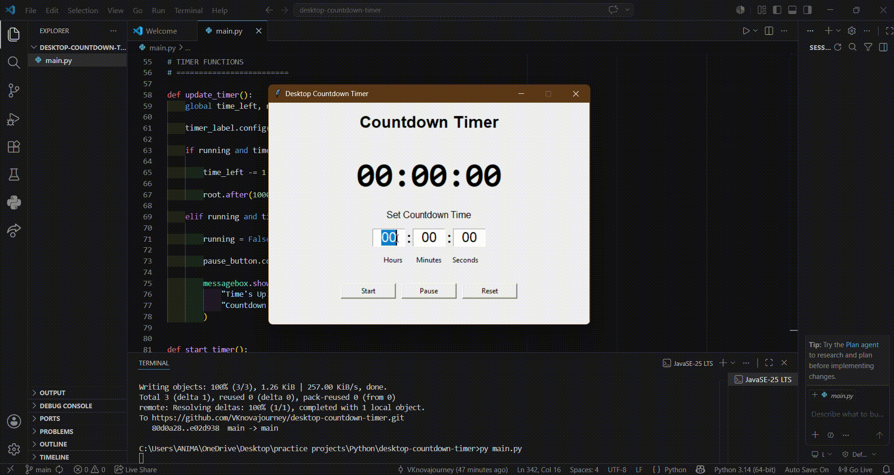

# Desktop Countdown Timer

A simple desktop countdown timer built using Python and Tkinter.

## Preview

### Screenshot



### Demo



---

## Features

* HH : MM : SS time input
* Start countdown
* Pause / Resume functionality
* Reset timer
* Real-time digital display
* Popup alert when timer reaches zero
* Input validation
* Auto-focus between input fields

---

## Built With

* Python 3
* Tkinter (built-in GUI library)

---

## Project Structure

```text
desktop-countdown-timer/
│
├── main.py
├── README.md
├── .gitignore
│
├── assets/
│   ├── screenshot.png
│   └── demo.gif
│
└── LICENSE
```

---

## Installation

Clone the repository:

```bash
git clone https://github.com/YOUR_USERNAME/desktop-countdown-timer.git
```

Move into the project directory:

```bash
cd desktop-countdown-timer
```

Run the application:

```bash
python main.py
```

---

## Usage

1. Enter Hours, Minutes, and Seconds.
2. Click Start.
3. Use Pause to temporarily stop the timer.
4. Click Resume to continue.
5. Use Reset to return the timer to its default state.
6. A popup appears when the countdown finishes.

---

## Learning Objectives

This project was created to practice:

* Tkinter GUI development
* Event-driven programming
* State management
* Input validation
* Working with timers using `root.after()`
* Python application structure

---

## Future Improvements

* Progress bar
* Dark mode
* Sound notification
* Custom themes
* Preset timers
* System tray support

---

## License

This project is licensed under the MIT License.
